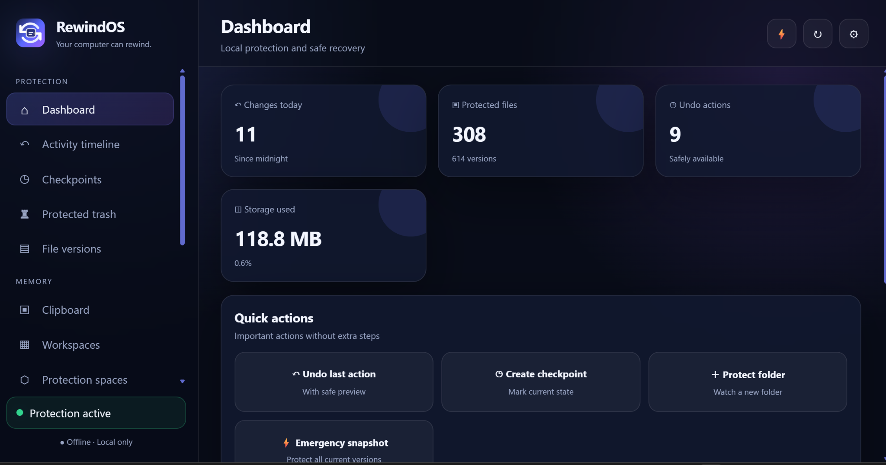
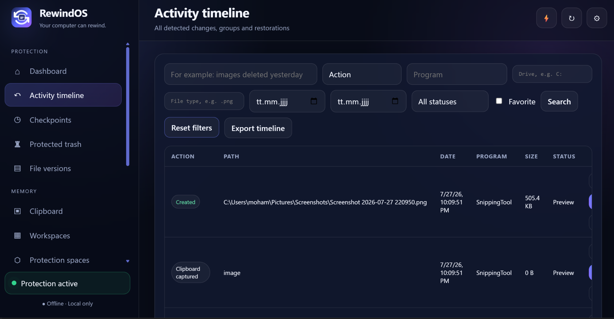
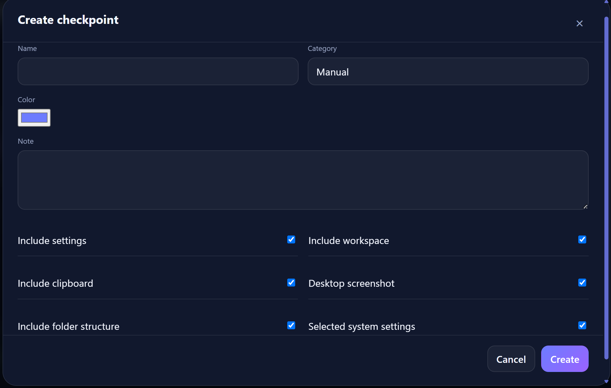
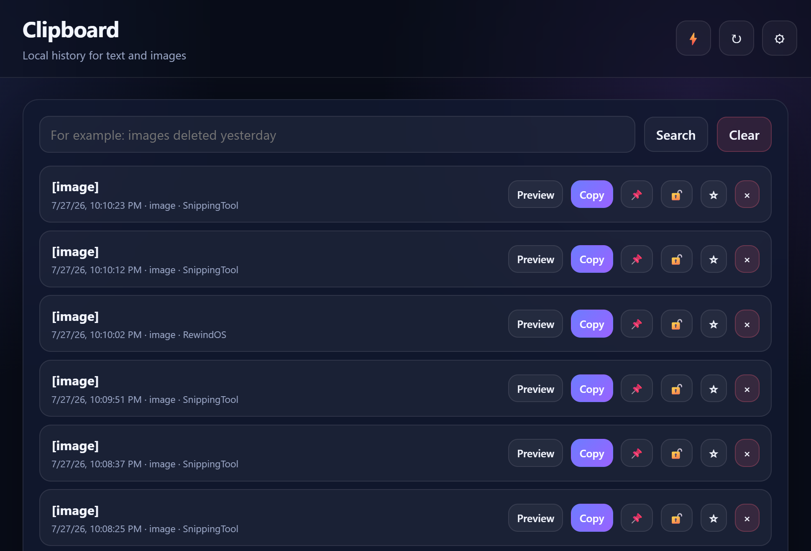
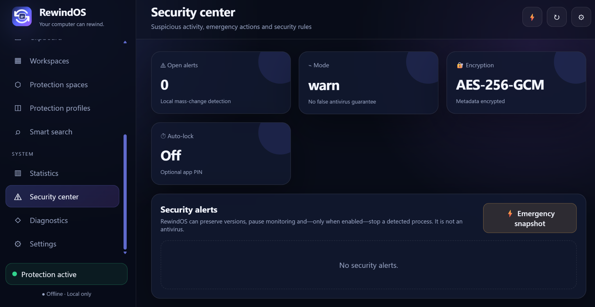
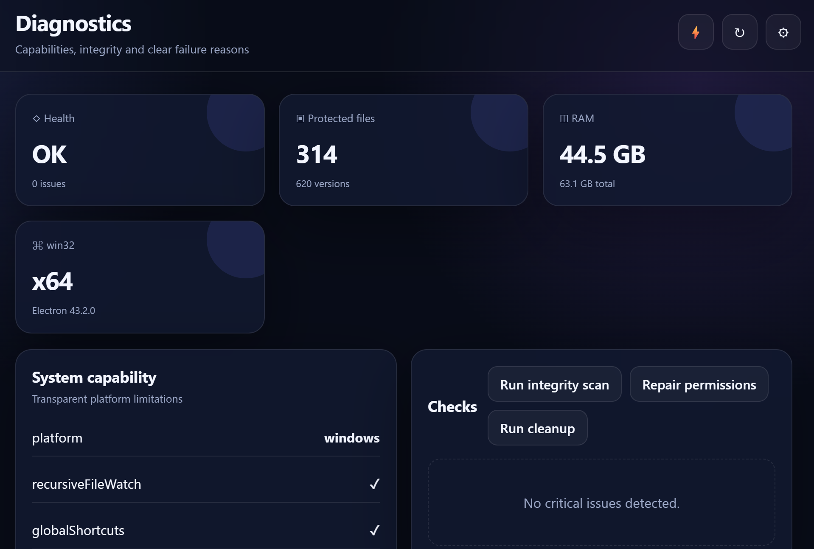
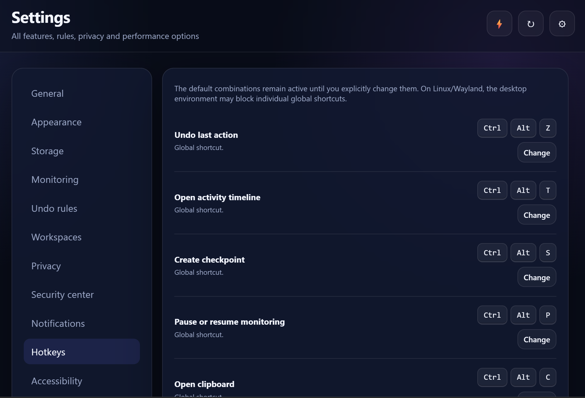

# RewindOS

<p align="center">
  
</p>

<p align="center"><strong>Your computer can rewind.</strong></p>

<p align="center">
  Free · No ads · No Pro version · No account · Offline · Local-first · Windows & Linux
</p>

RewindOS is a private undo and recovery center for Windows and Linux. It watches only folders selected by the user, creates protected local file versions and helps recover deleted, overwritten, renamed, moved or modified files. All normal use works locally without an account, Firebase or a permanent internet connection.

## Download

### Windows

Add the tested Windows installer to [`releases/windows`](releases/windows/) or attach it directly to a GitHub Release.

Recommended files:

- `RewindOS-Setup-0.4.0.exe`
- `RewindOS-Portable-0.4.0.exe` — optional
- `SHA256SUMS-Windows.txt`

### Linux

Linux packages are generated automatically by GitHub Actions from the same source code:

- AppImage
- DEB
- RPM
- SHA-256 checksums

Open **Actions → Build RewindOS → Run workflow** and download the artifact **RewindOS-Linux**. Creating the tag `v0.4.0` builds Windows and Linux and publishes the generated files in one GitHub Release.

Detailed instructions: [`docs/GITHUB_SETUP.md`](docs/GITHUB_SETUP.md)

## Important: select a protected folder first

RewindOS intentionally does not scan the whole computer or the Windows recycle bin automatically.

To see exactly what was deleted or changed, the user must first select the relevant folder:

1. Open RewindOS.
2. Click **Protect folder**.
3. Select a folder such as Pictures, Documents, Desktop or a project folder.
4. Wait for the initial protected versions to be created.
5. Changes made afterwards appear in **Activity timeline** with the file name, original path, date, time, action and the responsible program when available.

When a protected image or file is deleted, it appears in **Activity timeline** and **Protected trash**. Selecting **Restore** returns it to its original folder. **Test restore** creates a separate test copy and leaves the original location unchanged.

A file that was deleted before its folder was protected cannot be recovered retroactively by RewindOS. It may still be available in the operating system recycle bin.

Full instructions: [`docs/USER_GUIDE.md`](docs/USER_GUIDE.md)

## Screenshots

### Dashboard



### Activity timeline



### Checkpoints



### Clipboard history



### Security center



### Diagnostics



### Editable hotkeys



## Main features

- Guided first-run setup in English or German
- Activity timeline with search and filters
- Protected trash and file version history
- Restore preview, dry run and test restore
- Selective recovery and undo chains
- Checkpoints and recovery collections
- Workspaces with application and window context
- Local clipboard history for text and images
- Protection profiles and protected project spaces
- Mass-change detection and emergency snapshots
- Encrypted local vault using AES-256-GCM
- Integrity checks, diagnostics and recovery rollback
- Optional PIN and automatic lock
- Configurable global hotkeys
- Windows Explorer and Linux file-manager integration
- AppImage, DEB, RPM, NSIS installer and portable Windows build targets
- Dark, light and system themes with accessibility options

The complete feature mapping is available in [`docs/REQUIREMENTS_MATRIX.md`](docs/REQUIREMENTS_MATRIX.md) and [`docs/FEATURES.md`](docs/FEATURES.md).

## Privacy and security

- No account is required.
- No telemetry or advertising is included.
- Normal operation is fully offline.
- Only user-selected folders are watched.
- The renderer runs sandboxed without Node.js access.
- File operations are handled in the privileged main process through validated IPC requests.
- Imported recovery packages are quarantined, validated and applied transactionally.
- RewindOS is an additional protection layer, not a replacement for independent backups or antivirus software.

Security details: [`SECURITY.md`](SECURITY.md) and [`docs/SECURITY_AUDIT.md`](docs/SECURITY_AUDIT.md)

## Build from source

Requires Node.js 22 or newer.

```bash
npm install
npm run verify
npm start
```

### Build Windows

```powershell
Set-ExecutionPolicy -Scope Process Bypass
.\scripts\build-windows.ps1
```

### Build Linux

```bash
chmod +x scripts/build-linux.sh
./scripts/build-linux.sh
```

Generated packages are written to `dist/`.

## Verification status

Version 0.4.0 includes:

- 77 automated tests
- 49 executable requirement checks
- source, translation, sandbox, CSP and packaging validation
- Windows and Linux build workflows

Real installer, upgrade, uninstall and code-signing tests must also be performed on genuine Windows and Linux systems before a public release.

## License

RewindOS is released under the [MIT License](LICENSE).

Copyright © Rahmi Apps
